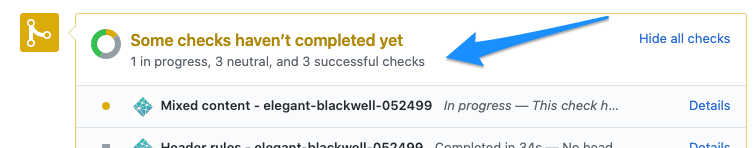
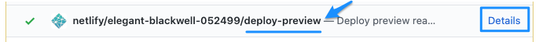
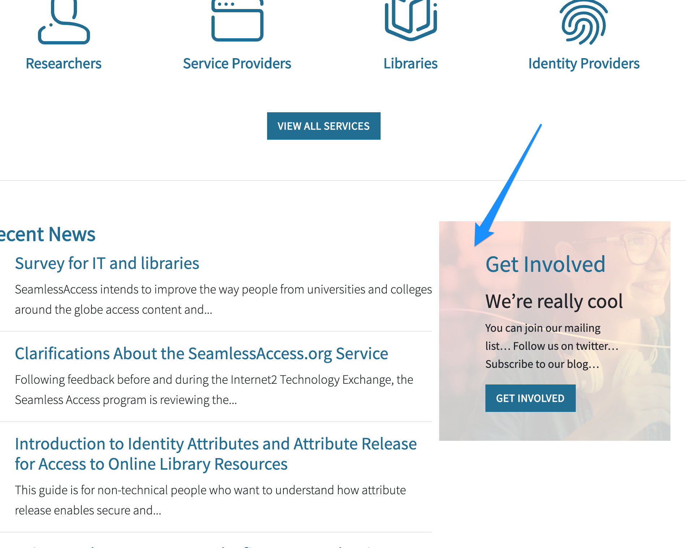
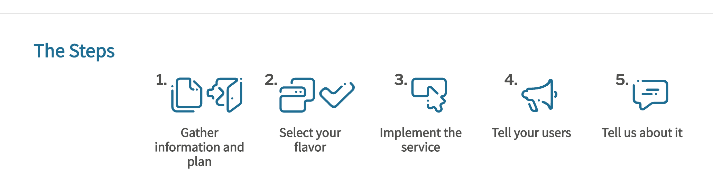
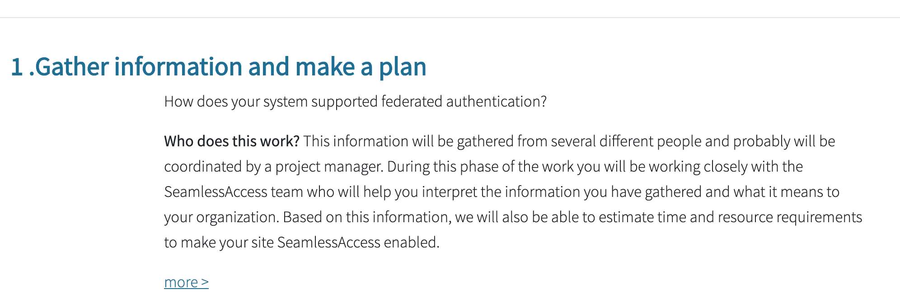
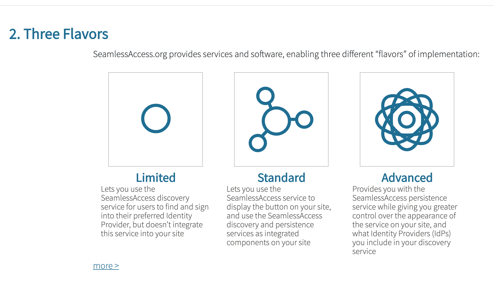
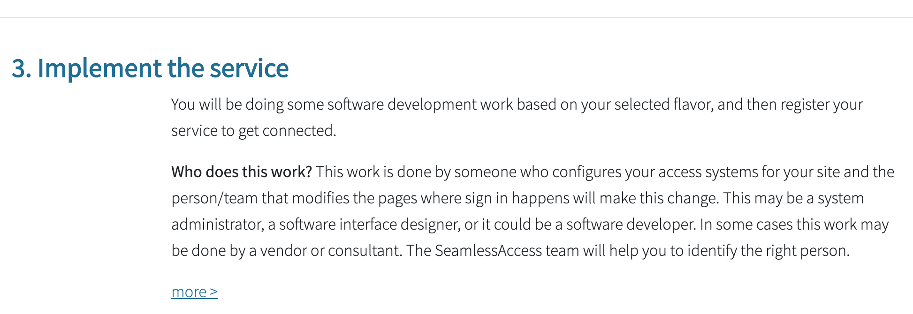
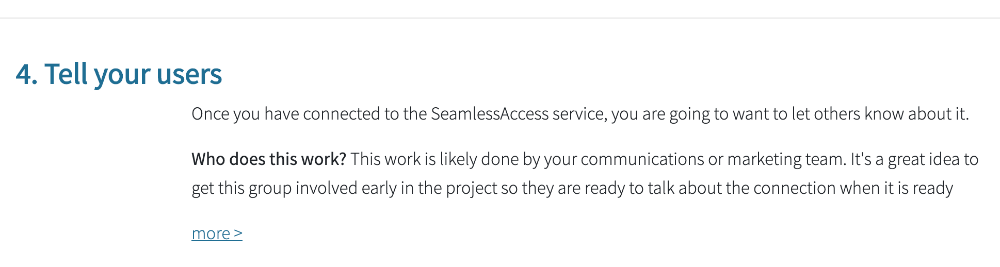
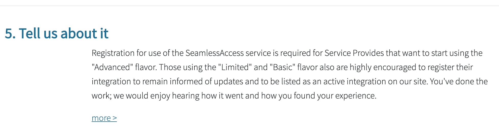

[](https://app.netlify.com/sites/seamlessaccess-web/deploys)

# Seamless Access Website

**Table of Contents**

* [Before you start](#before-you-start)
  * [About HUGO versioning](#about-hugo-versioning)
* [The process for making updates](#the-process-for-making-updates)
* [Updating metadata](#updating-metadata)
* [Social media connections](#social-media)
* [Updating the site](#updating-the-site)
  * [General components](#general-components)
  * [Home page](#home-page)
    * [Service section](#the-service)
    * [In Action section](#in-action-section)
    * [About section](#about-section)
    * [Contact section](#contact-section)
  * [Getting Started Page](#getting-started-page)

# Before you start

> **IMPORTANT!!** ALL CHANGES to the website should be made in branches that are merged via a pull request into the `Master` Branch.
>
> The site is deployed from the `Live` branch.
>
> Changes should NEVER be committed directly to the `Live` branch - this will not work. They must be put onto the master branch and then submitted by pull request to the `Live` branch. The reason that this process is required is twofold:
>
> 1. there are critical site checks that are performed to ensure that the site builds correctly, and 
> 2. this process also provides an opportunity to preview the changes before they go live - an important best practice. 
> 
> **If this process is not followed, the site will not build.**

## About HUGO versioning

Occasionally a Hugo update will provide functionality that you'll want to leverage on the site. This situation happened in early 2020 when we wanted to include code syntax highlighting on the site which is only available in version 0.60 and later. The sit was originally published with version 0.51 of Hugo. 

When updating, you will first need to update the Hugo version on your own computer. In addition, you'll need to update the Hugo version used for the build by making changes in the file at `themes > hugo-hero-theme > netlify.toml`. Note that other changes can be made in this file to affect build characteristics, for example, building differently for staging environments (perhaps to show items that are in draft status). Additional information about configuration parameters can be found on the Hugo site at https://gohugo.io/hosting-and-deployment/hosting-on-netlify/.

# The process for making updates

1. Make and check the changes that you are going to make. ** Before making and saving changes, it is a good idea to create and use a branch for your changes

2. Run the pages locally to make sure that they look okay 

    * Type `hugo server -D` on the command line to run the website on your computer. You will need to type this command from the folder where your website files are stored. 
    * Navigate to `http://localhost:1313/` in your browser to see the site locally. **What you see here is NOT what is currently on the website**
    * You can make changes in the files and (for most changes) when you save them in your files, the changes will be reflected on your local branch and in your browser (if hugo is still running.)
    * to stop your local website from running, type control-C from your keyboard.

3. When you are satisfied with your additions and changes, make sure that all of your changes have been committed to the master branch on Github. (It's a great idea to do this from a separate branch, and make a pull commit to contribute these changes to the site.)

4. Create a pull request from the `Master` branch to the `Live` branch. This action will build the static site in Hugo, and run some diagnostics to ensure that the build worked well. You will need to wait until all of the checks have completed before doing the next step:

  

5. Once the checks are complete, preview the site by clicking the "details" link on deploy-preview. Review all of the pages that you changed, and check all of the links. If anything needs to be corrected, make the corrections in the master branch. You should be able to see the changes in the deploy preview once the build is complete.

  

6. Once you're happy with the changes, merge the pull request to push the changes to production.

# Updating metadata

## Site subfooter

The information displayed in the site sub-footer is contained in the `data > contact.yaml` file. If any item is left blank (empty inside of the quotes), it will not display in the footer.

To add things to this subfooter, the `Layouts > Partials > sub-footer.html` file must be edited to include these items.

_NOTE: the Business Name is displayed in the copyright in the main footer and in the address if one exists._

# Social media

The site has been encoded with social media for the following types:

* Twitter
* YouTube
* Instagram
* LinkedIn
* Medium
* Facebook
* ORCID

## Adding social media

To add social media links, update the social data file

`data > social.yaml`

Only items with a value will be displayed. If you do not want to include one of these social types, just leave the value blank.

## Displaying social media

Social media is configured to be displayed for any item with a value in the data file. 

**Displaying in the footer**

It will display in the footer as the social media icon which is also a link to the social media asset. The link will follow that put into the data file. To edit the display, you will need to edit the partial found at 

`themes > hugo-hero-theme > layouts > partials > social.html`

**Displaying elsewhere on the site**

If you want to dipslay the soical media links on a page somewhere, you can do so by including the following text in your markdown file:

``

This addition will display a list of the available social media assets with the social logo and a short phrase liek "Follow us on twitter". To edit the display, you will need to edit the shortcode found at

`layouts > shortcodes > socialinfo.html`


# Updating the site

## General components

### Logos

These are stored in the `static/images` folder

* The site logo must be called `logo.svg`
* There must be a mobile version of the logo which must be called `logo-mobile.svg`
* If either logo needs to be changed, its file can just be replaced in this folder.

### Site favicon

* This image is stored in the static folder and must be called `favicon.png`

## Home page

### Hero

The home page hero is specified in the `content/_index.md` file which contains the following parameters:

* **date**: The date & time that this section was last updated. This date is not displayed anywhere, but updating it can be handy for others who may be editing this part of the page
* **heroHeading**: This is the header text displayed in the hero
* **heroSubHeading**: This is the sub header text displayed in the hero
* **heroBackground**: This is the background image displayed. This image is automatically colored by the general site color settings (see above). The image must be added to the folder `static/images` and the file name in this markdown file should reflect the name of the file that you want displayed (note: the file name is in quotes, and is in the format `'images/<file-name>'`)

### The rest of the home page

The rest of the home page is configured in the `content/homepage` folder. Each markdown file describes a section of the home page. The `index.md` file will not need to be edited.

For each section of the site, you will create a new markdown page (with the exception of one section which is described below.) Each markdown file has a header and a body.

In the header:

* **title**: The header text in the section
* **weight**: A number representing the order that this section should appear on the home page
* **background** _(optional)_: The background image that should be displayed, if any. As will the hero background, the file should be stored in the `static/images` folder, and the file name is listed here.  (note: the file name is in quotes, and is in the format `'images/<file-name>'`). If there should be no background image, use the value `''`.
* **button** _(optional)_: The text that should be displayed on a button.
* **buttonLink** _(included if there is a button value)_: Where the reader should be directed when they click the button.

In the body of the markdown file, you should include the text that you want to display under the header.

---

## The Service

_This content is stored in the `content > services` folder_

The content included in the services folder are used in multiple places:

* As single pages
* As summaries, such as on the home page
* As a list of services, for example, on the services landing page

From a content perspective, each page should have the following header elements:

Name | Description | Example
---- | ----------- | -------
title | the title for the page. Displayed on the browser title bar | title: 'SeamlessAccess for Researchers'
date | the publication date for the page. This field is optional, but useful to get search engines to re-index the page if it changes | date: 2018-11-18T12:33:46+10:00
icon | an image to be displayed for the service in summary and list views. The image should be included in the `static > services` folder | icon: 'services/service-icon-1.png'
draft | indication if this page is a draft or not. It is possible that this feature is not implemented on this site - not tested | draft: false
featured | Indication if this page should display in the summary view. Only the featured items are included in the summary view with a link to see all services | featured: true
weight | the order that this item should be displayed in the list and summary views. Note, this is a dumb indicator. You are going to want to be careful about assigning different numbers to each page to avoid conflicts | weight: 1
heroHeading | on the page there is text that can be displayed over the hero image. This optional text will be displayed as a header | heroHeading: 'SeamlessAccess for Researchers'
heroSubHeadingLead | Additional text that can be displayed over the hero image. This optional text will be displayed as lead-in text to the sub header and will be styled differently | heroSubHeadingLead: 'Catchy Lead-in! '
heroSubHeading | Additional text that can be displayed over the hero image. This optional text will be displayed as a sub header | heroSubHeading: 'Include a useful subheader here'
heroBackground | the image that is displayed as a hero image. Note that this image is automatically overlayed with an overlay background to make all images look more similar to each other | heroBackground: 'services/service1.jpg'

---

## In Action section

_This content is stored in the `content > work` folder. There is no menu pick for this content - it is displayed on the home page and at the bottom of the services page._

### Use Cases

Use cases are displayed from the "In Action" section on the home page. There is no top-level link to this content. The In Action section provides links to demos, videos, etc; lists of implementations; and use cases that one can use to get a sense of how SeamlessAccess works, and who is using it.

The content for this section is stored in the `content > work` folder. The `_index.md` page provides the front matter for the In Action section, and each additional page listed serves as a use case. For each use case, you will need the following header elements:

Name | Description | Example
---- | ----------- | -------
title | the title for the page. Displayed on the browser title bar | `title: 'SpringerNature'`
date | the publication date for the page. This field is optional, but useful to get search engines to re-index the page if it changes | `date: 2018-11-18T12:33:46+10:00`
draft | indication if this page is a draft or not. It is possible that this feature is not implemented on this site - not tested | `draft: false`
weight | the order that this item should be displayed in the list and summary views. Note, this is a dumb indicator. You are going to want to be careful about assigning different numbers to each page to avoid conflicts | `weight: 1`
heroHeading | on the page there is text that can be displayed over the hero image. This optional text will be displayed as a header | `heroHeading: ''`
heroSubHeading | Additional text that can be displayed over the hero image. This optional text will be displayed as a sub header | `heroSubHeading: ''`
heroBackground | the image that is displayed as a hero image. Note that this image is automatically overlayed with an overlay background to make all images look more similar to each other. While this image can be referenced by URL, it is a little safer to store the image in the `static > work` folder and reference it here `'work/fileName.jpg'` | `heroBackground: 'https://source.unsplash.com/tjX_sniNzgQ/1600x400'`
thumbnail | this is the image that displays on the summary and list version. You can make it the same as the header image, or something different (including the same image with different dimensions | `thumbnail: 'https://source.unsplash.com/tjX_sniNzgQ/400x300'`
images | a list of images for the gallery. Note the format shown in the example | `images: ['https://source.unsplash.com/random/400x600/?nature', 'https://source.unsplash.com/random/400x300/?travel','https://source.unsplash.com/random/400x300/?architecture','https://source.unsplash.com/random/400x600/?buildings','https://source.unsplash.com/random/400x300/?city','https://source.unsplash.com/random/400x600/?business']`

---

## About section

_This content is stored in the `content > about` folder._

### Intro text

This is written in markdown in the `index.md` file. There is a header that affects the background image:

Name | Description | Example
---- | ----------- | -------
title | The title for the page. Displayed on the browser title bar | title: 'About'
date | the publication date for the page. This field is optional, but useful to get search engines to re-index the page if it changes | date: 2018-12-06T09:29:16+10:00
layout | indicates that the layout that should be used is the "about layout". Don't change this value | layout: 'aboutlayout'
hero | as with the other pages, you can include a hero image and text here. the usual fields are included | hero: false; heroHeading: ''; heroSubHeading: ''
background | the image that is behind the text that is shown behind the text in markdown. If you have an image that is light on the left side, with an image on the right, it will look best (without update of the layout) |background: 'https://source.unsplash.com/zglUlG8k47I/1600x500'

### Subsections

Each subsection is a separate page in the `about` folder. They are displayed in order by their weight. The intro paragraph is "highlighted" with emphasized text. The headers for these pages should be as follows:

Name | Description | Example
---- | ----------- | -------
title | The title for the page. Displayed on the browser title bar | title: 'Community'
date | the publication date for the page. This field is optional, but useful to get search engines to re-index the page if it changes | date: 2018-12-06T09:29:16+10:00
icon | this image is shown in the list on the about landing page. the image should be square, and will automatically be resized to be the same size. | icon: 'features/noun_The Process_1885341.svg'
featured | This value needs to be true to be shown on the about landing page | featured: true
draft | indication if this page is a draft or not. It is possible that this feature is not implemented on this site - not tested | draft: false
type | indicates the layout type for the page - this should remain as "about" | type: about
description | this text is displayed on the about landing page | description: "Short description here. New image is needed."
weight | the order that this item should be displayed in the list and summary views. Note, this is a dumb indicator. You are going to want to be careful about assigning different numbers to each page to avoid conflicts | weight: 2
hero | as with the other pages, you can include a hero image and text here. the usual fields are included | heroHeading: 'SeamlessAccess.org Community'; heroSubHeading: 'Who is SeamlessAccess?'; heroBackground: 'https://source.unsplash.com/_v-EHHKKW3w/1600x700'

---

## Contact section



### HOME PAGE CONTENT

The information displayed in the box comes from the following file:

`content > homepage > contact.md`

* **Title** = blue “Get Involved” text. Note that it displays in title case regardless of how you type it in at the metadata
* **Background** = the background image in this section. NOTE: the background is an overlay of the light grey color on the site. If no image is included, the background will be light grey by default
* **Button** = the text displayed in the button. Note that it will be in all caps regardless of how it is expressed in the metadata
buttonLink = the page that the reader will go when clicking the button - this is currently configured to go to the “contact” section of the site, or the content at `content > contact > _index.md`
* **Body** = whatever you put into the body of this file will display in this box on the home page. You can use normal markdown formatting.
* **Weight** = Please leave this number as-is. It is currently used as a shortcut for the rendering engine to know which content from the homepage content folder goes in this box.

### HOME PAGE FORMATTING

To format this section, you need to edit the following file:

`layouts > index.html`

At the time of this writing, the rendering of this box can be found in lines 103-115 of this file.

``` html
103      <!-- Contact -->
104      {{ range first 1 $reusablePages }}
105      <div class="col-12 col-md-4">
106        <div class="row bg-ltgrey bg-cover bg-position-top bg-overlay pt-4 pb-4" style='background-image: url("{{ .Params.background | relURL }}");'>
107          <div class="col-2"></div>
108          <div class="col-8">
109          <h2 class="text-primary text-capitalize">{{ .Title }}</h2>
110          <p>{{ .Content }}</p>
111          <a class="button" href="{{ .Params.buttonLink | relURL }}">{{ .Params.button }}</a>
112          </div>
113          <div class="col-2"></div>
114        </div>
115      </div>
116      {{ end }}
```

* **Lines 104 & 116** functionality select the contact.md file from the homepage content folder.
* The div in **line 105** places the block in 4 columns (of the 12 column block to place it next to the recent news section (which is 8 columns). This arrangement is if the responsive size is medium or larger. If smaller, this block takes up the full width of the screen (12 columns)
* **Lines 107, 108 and 113** makes a 2:8:2 size ratio across the width - blankspace to content block to blankspace.
* **Line 109** uses the “title” parameter in the home page content (above) and renders it capitalized in H2 size in the primary color (blue) 
* **Line 120** renders the content (body) in the home page content (above). It uses the style sheet used over the rest of the home page.
* **Line 111** renders the button which links to the page listed in the buttonLink parameter and displays the text in the button parameter as displayed in the home page content (above)

### CONTACT PAGE

When the user clicks the button on the home page, they will be brought to the “contact” page. The content for this page can be found here:

`content > contact > _index.md`

The layout for this page uses can be found here:

`layouts > contact > contact.html`

Site wide data that are used in the contact page can be found in the following file:

`data > contact.yaml`

* email 
* phone
* businessName
* address - note that the address is only displayed if there is one configured
* url


---

## Getting Started Section

The landing page for this section is a little different from the others - it is organized more like the Home Page is. Since each part of the landing page for Getting Started is slightly different from the others, it is less configurable than the other pages on the site, and will require some HTML in some cases to make adjustments. This is where you find each of the pieces of content for the page:

### OVERALL FORMATTING

The Getting Stated page is formatted in the file `layouts > work > list.html`. Page-specific styling for this page can be found in `assets > pages > work > _page-work-list.scss_` (Though, at the time of this writing, this file is empty.) It is best for someone who is familiar with HTML and/or CSS to edit these files. However, some of the content can be updated by non-coders

### INTRODCTION


**CONTENT LOCATION**: `content > work > _index.md`

The lead-in content and hero image are specified in the index file in the work section.

### THE STEPS LISTING



**CONTENT LOCATION**: `data > startedsteps.json`

The steps listed here are configured in a data file to make them easier to adjust if necessary. Each mini-block (image with a description) is a separate object listed in the data file. The header of this section is configured in the HTML for this section - see below.

Name | Description | Example
---- | ----------- | -------
title | _not used_ | 
description | The text displayed under the image | "Gather information and plan",
image | the relative URL for the item. These images should be stored in the `static > getting-started` folder | "features/getting-started/icn_gettingstarted-1.svg"
sectionurl | the relative URL for the details for this step. The name included here generaly will be the file name of one of the files within the `content > work` folder, without the `.md` extension. | "step1"

### STEP 1



**CONTENT LOCATION** _(Landing page section)_: `layouts > partials > work-step-1.html`

The content displayed on the Getting Started landing page and that on the Step 1 content page are in different locations. 

**CONTENT LOCATION** _(Interior page section)_: `content > work > step1.md`

The interior pages of this section have a few attributes that can be used to control content. Otherwise the content is managed as it is with other pages on the site. The page attributes for the interior pages in the Getting Started section (`content > work` folder)

Name | Description | Example
---- | ----------- | -------
title | The page title | 'Step 1'
date | Publication / update date for the page | 2020-02-15T12:33:46+10:00
draft | Indication of if the page is a draft of not | false
weight | The order that this page should be displayed when a list of pages in this section are shown | 1
stepname | The descriptive title for the step | 'Gather information and make a plan'
heroBackground / heroHeading / heroSubHeading | As with other section of the site, the Getting Started section can have a hero image with a heading and subheading. At the time of this writing, they are not used. |''
thumbnail | The theme being used has a format to list summaries of items included in the `work` content folder (`themes > hugo-here=theme > layouts > work > summary.html`). At the time of this writing, this feature is not used. If used, the thumbnail image specified for this attribute would be displayed in the summary | ''
images | This attribute expects a list of image URLs (using the conventions used elsewhere), separated by commas. When present, it will display these images in a gallery at the bottom of the page. | []

### STEP 2



**CONTENT LOCATION** _(Landing page section)_: `data > implementflavors.json`

The implementation flavors listed here are configured in a data file to make them easier to adjust if necessary. Each mini-block (image with a title and description) is a separate object listed in the data file. The header for this section and lead in for the implementation flavors are configured in the landing page HTML file as describe in the "Overall formatting" section above.

Name | Description | Example
---- | ----------- | -------
title | The title displayed just under the image in the section | "Limited"
description | The text displayed under the image | "Lets you use the SeamlessAccess discovery service for users to find and sign into their preferred Identity Provider, but doesn’t integrate this service into your site"
image | the relative URL for the item. These images should be stored in the `static > work` folder | "work/icn_flavors_limited.svg",

**CONTENT LOCATION** _(Interior page section)_: `content > work > step2.md`

This page is configures as for Step 1 described above.

### STEP 3



**CONTENT LOCATION** _(Landing page section)_: `layouts > partials > work-step-3.html`

The content displayed on the Getting Started landing page and that on the Step 3 content page are in different locations. 

**CONTENT LOCATION** _(Interior page section)_: `content > work > step3.md`

This page is configures as for Step 1 described above.

### STEP 4



**CONTENT LOCATION** _(Landing page section)_: `layouts > partials > work-step-4.html`

The content displayed on the Getting Started landing page and that on the Step 4 content page are in different locations. 

**CONTENT LOCATION** _(Interior page section)_: `content > work > step4.md`

This page is configures as for Step 1 described above.

### STEP 5



**CONTENT LOCATION** _(Landing page section)_: `layouts > partials > work-step-5.html`

The content displayed on the Getting Started landing page and that on the Step 5 content page are in different locations. 

**CONTENT LOCATION** _(Interior page section)_: `content > work > step5.md`

This page is configures as for Step 1 described above.

